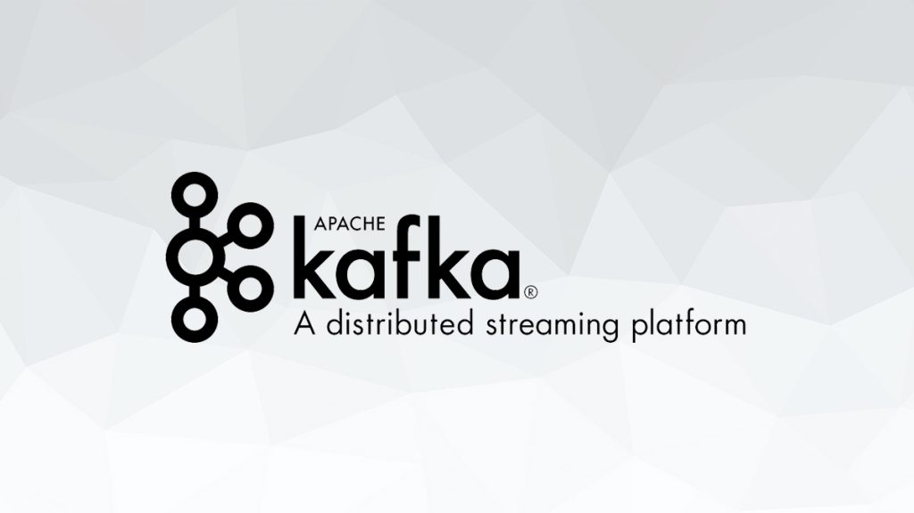

  

# Kafka Fundamentals

This project provides a structured approach to understanding Kafka fundamentals. Dive into the world of Kafka with practical examples and scripts for setting up, managing, and using Kafka.

## 📁 Table of Contents

- [Setup](#setup)
- [Topics](#topics)
- [Kafka Administration](#kafka-administration)
- [Producer](#producer)
- [Kafka Producer](#kafka-producer)
- [Consumer](#consumer)
- [Kafka Consumer](#kafka-consumer)
- [Kafka Streams](#kafka-streams)

## 🛠️ Setup

The `01_setup` directory contains scripts and configuration files for setting up Kafka. Configure brokers, ZooKeeper, and other essential components with the provided scripts.

## 💬 Topics

In the `02_topics` directory, explore examples related to Kafka topics. Learn to create and manage topics with ease.

## 📈 Kafka Administration

The `03_kafka-admin` directory holds Java-based Kafka administration tools. Dive into topics like Kafka AdminClient and more.

## 🚀 Producer

In the `04_producer` directory, you'll find scripts for Kafka producers. Learn how to produce messages into Kafka topics effectively.

## 💾 Kafka Producer

The `05_kafka-producer` directory provides Java-based Kafka producer examples. Discover advanced producer configurations and techniques.

## 📥 Consumer

Navigate to the `06_consumer` directory for Kafka consumer scripts. Understand various consumer-related topics like consuming in groups, managing consumer groups, and resetting offsets.

## 📬 Kafka Consumer

In the `06_kafka-consumer` directory, access Java-based Kafka consumer examples. Explore features such as consuming with a shutdown hook and simple consumer implementations.

## 🌪 Kafka Streams

The `07_kafka-streams` directory showcases Kafka Streams examples. Learn stream processing with topics like aggregating, joining, and stateless stream processing.

For detailed usage and instructions, please refer to the specific directories and files within this project.

---

Unlock the power of Kafka and master its fundamentals through hands-on examples and in-depth explanations. Kafka awaits you!

